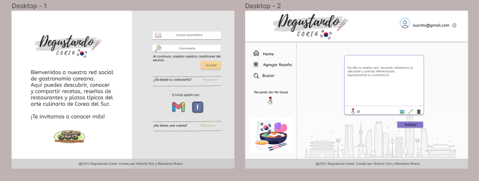

# Degustando Corea 

## 1. Bienvenid@ a nuestra App 

Degustando Corea es una aplicación web pensada en el "boom" que ha provocado últimamente Corea del Sur, ya sea desde sus grupos musicales, Series y su tan llamativa gastronomía. 
Nuestra App está orientada justamente en eso, en personas degustadoras de estos platos y que quieran compartir sus conocimientos y experiencias ya sea en locales que vendan productos coreanos, restaurantes y recetas, sin dejar de lado que también es una muy buena herramienta para las personas que estan interesadas en comenzar a probar esta deliciosa gastronomía. 

## 2. Definición de la App

#### * Principales Usuarios

Nuestros principales usuarios son personas jóvenes (adolescentes) y adultos que conozcan de alguna manera la cultura de Corea del Sur, ya sea por grupos musicales o series, ya que este es el primer paso para interesarse en la gastronomía del país.

#### * Solución al problema

Ideamos esta app pensando justamente en estas personas que estan interesadas en esta cultura y que no hay muchos recursos o información ya que recientemente hay un interés masivo en esta cultura, por ende creemos que es una buena manera de resumir y canalizar esta información y que mejor que sea a través de la experiencia de los mismos clientes. 

## 3. Historias de Usuarios

Definimos nuestras Historias de Usuarios a través de una breve encuestra realizada en google Form, para verla puedes pinchar [aquí.](https://forms.gle/okDQAZ2qDNRWm71g7)

Al obtener los resultados, destacamos las respuestas que tuvieron más porcentaje y así, definimos las siguientes Historias de Usuarios:

**HU1:** _"Yo como usuario de redes sociales, estoy familiarizado con Instagram"_
Esto lo destacamos debido a la importancia de nuestro prototipo y diseño de la app, para tener en cuenta como el clientes se sentiría más cómodo mientras usara la aplicación.

**HU2:** _"Yo como interesado en probar la gastronomía coreana quísiera leer reseñas sobre datos de restaurantes o locales típicos"_
Con esto quisimos definir que les gustaría leer o añadir mediante los posts. 

### Prototipo de Baja Fidelidad

Al contar con la primera historia de usuario, decidimos realizar un diseño similar a Instagram pero muy sencillo, primero realizamos el de Celular para luego pasar al de Escritorio.

### Prototipo de Alta Fidelidad

Realizamos el protitopo en Figma además de diseñar el logo en Canva.
Usamos colores suaves e imágenes referenciales a Corea del Sur y su cultura.

### Test de Usabilidad

Mediante la realización de nuestra app recibimos constantes Feedbacks, lo cual nos llevó a modificar parte del diseño para que este fuera más amigable para el usuario.
En cuanto a los test, consultamos con varias personas destacando lo siguiente:

**HU1:** 
_Experiencia:_ La página es bastante amigable ya sea en escritorio o celular, me gusta mucho que tenga un breve resumen ya que así sé de que se trata la app, en cuanto al diseño, me gustó bastante la paleta de colores y las imágenes utilizadas, sobre todo el corazón coreano. Un Feedback, el botón de home no funciona por ende no se muy bien porqué esta ahí.

**HU2:** 
_Experiencia:_ La verdad que como usuario que no conoce mucho de la comida coreana, me llamó mucho la atención la página, es bien interesante para uno que no conoce mucho, poder saber de lugares a los que pueda ir. La funcionalidad de la página me parecio bastante sencilla, muy similar a las otras apps por ende no fue díficil  registrarse o ingresar, es sencillo eliminar y editar post aunque si pensé que al editar el post sería más "evidente" ya que se edita en el mismo contenedor y uno no se da cuenta y piensa que no está haciendo nada, pero para guardar es muy fácil.

**HU3:** 
_Experiencia:_ Me gustó mucho el diseño, los colores, la tématica, creo que es una muy buena aplicación ya que a mi me encanta la comida coreana. El like es lo más lindo. En resumen, es una página muy buena, sencilla, bonita, está muy bacan. 

### Conclusión

Para finalizar, concluimos gracias a los tests de usabilidad, que nuestra página es bastante amigable para el usuario, no les dificultó registrarse, ni iniciar ni cerrar sesión, tampoco el agregar reseña con el modal. 
En cuanto al diseño, hicimos pocos cambios, eliminando, modificando y agregando elementos adicionales para que la experiencia del usuario fuera más optima. 

### Enlace

Les dejamos el enlace para nuestra página web.

[Degustando Corea](https://macarenarivera.github.io/SCL018-social-network/src/#/login)
